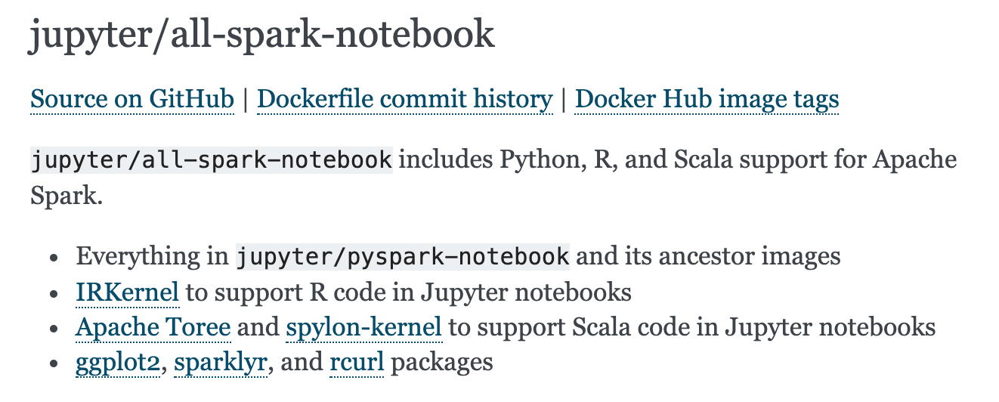

# Introducción a Spark

- [Introducción a Spark](#introduccion-a-spark)
  - [Módulo 1 Conociendo Apache Spark](#modulo-1-conociendo-apache-spark)
    - [Presentación del Laboratorio](#presentacion-del-laboratorio)
    - [Introducción a Apache Spark](#introduccion-a-apache-spark)
      - [Historia](#historia)
      - [Spark VS Hadoop](#spark-vs-hadoop)
    - [Introducción a los RDDs y DataFrames](#introduccion-a-los-rdds-y-dataframes)
      - [Componentes de Spark](#componentes-de-spark)
      - [Características de los RDD](#caracteristicas-de-los-rdd)
      - [Características de los DataFrame](#caracteristicas-de-los-dataframe)
      - [Cuando Usar RDD](#cuando-usar-rdd)
      - [Cuando Usar DataFrames](#cuando-usar-dataframes)
      - [Resumen](#resumen)
  - [Módulo 2 Configuración Ambiente de Trabajo ](#modulo-2-configuracion)
    - [Opción 1 Instalación del ambiente de trabajo en contenedor Docker](#instalacion-del-ambiente-de-trabajo-en-contenedor-docker)
      - [Imagenes de Docker en Juniper](#imagenes-de-docker-en-juniper)
      - [Ejecutar contenedor](#ejecutar-contenedor)
      - [Configuración de variables de entorno](#configuracion-de-variables-de-entorno)
      - [Descarga de Datos](#descarga-de-datos)
  - [Módulo 3 Operaciones RDDs](#modulo-3-operaciones-rdds)
    - [RDD y DataFrames](#rdd-y-dataframes)
      - [RDD](#rdd)
      - [DataFrames](#dataframes)
    - [Transformaciones y Acciones](#transformaciones-y-acciones)
    - [Acciones de modificación sobre RDDs](#acciones-de-modificacion-sobre-rdds)
    - [Acciones de conteo sobre RDDs](#acciones-de-conteo-sobre-rdds)
    - [Solución reto deportistas](#solucion-reto-deportistas)
    - [Operaciones Numéricas](#operaciones-numéricas)
  - [Módulo 4 Data Frames y SQL](#modulo-4-data-frames-y-sql)
    - [Creación de DataFrames](#creación-de-dataframes)
      - [Beneficios DataFrames](#beneficios-dataframes)
    - [Inferencia de tipos de datos](#inferencia-de-tipos-de-datos)
    - [Operaciones sobre DF](#operaciones-sobre-df)
    - [Agrupaciones y operaciones join sobre DF](#agrupaciones-y-operaciones-join-sobre-df)
    - [Solución reto joins](#solucion-reto-joins)
    - [Funciones de agrupación](#funciones-de-agrupación)
    - [SQL](#sql)
    - [Que es un UDF](#que-es-un-udf)
    - [UDF](#udf)
  - [Módulo 5 Persistencia y particionado](#modulo-5-persistencia-y-particionado)
    - [Particionado](#particionado)
    - [Comprendiendo la persistencia y particionado](#comprendiendo-la-persistencia-y-particionado)
      - [Persistencia](#persistencia)
    - [Particionando datos](#particionando-datos)

## Módulo 1 Conociendo Apache Spark

### Presentación del Laboratorio

En este Laboratorio aprenderemos sobre Spark y sus diferencias con otros frameworks, desarrollaremos un proceso ETL, aprenderemos sobre Manejo de las estructuras base de Spark y fundamentos de calidad de datos

Requisitos previos

- Programación Orientada a Objetos
- SQL

### Introducción a Apache Spark

Spark es un framework de trabajo para el desarrollo de grandes datos o big data y se preocupa de la velocidad y continuidad del procesamiento de datos, en contraparte de Hadoop que se preocupa por un almacenamiento grande de datos.

Podemos utilizar múltiples lenguajes

- Java
- Scala (Spark corre nativamente aquí)
- Python
- R

¿Qué no es Apache Spark?

No es una base de datos


**OLTP:** Sistema de modificación de Base de Datos online (Transaccional)

**OLAP:** Sistema de respuesta de consulta de datos online (Analisis)

Spark debe estar conectado a un Data warehouse para poder aprovechar toda su funcionalidad.

#### Historia

- Nace en 2009 en la Universidad Berkeley
- Hereda de Hadoop
- Versión 3 fue liberada en Junio 2020

#### Spark VS Hadoop

- Spark se enfoca en procesamiento de datos desde la memoria ram.

- Posee naturalmente un modulo para ML, streaming y grafos.

- No depende de un sistema de archivos.

### Introducción a los RDDs y DataFrames

#### Componentes de Spark

Las dos principales que soporta Spark son los **RDD** y los **DataFrames**.

La diferencia reside en la estructura que poseen.

Los **RDD** son el **componente mínimo con el cual podemos comunicarnos con Spark**, es un lenguaje ensamblador de spark.

#### Caracteristicas de los RDD

- **Principal Abstracción de datos** es la unidad básica, existen desde el inicio hasta la version 3 de Spark.

- **Distribución** Los RDD se distribuyen y particionan a lo largo del cluster de maquinas conectadas.

- **Creación simple** no tienen una estructura formalmente, adoptan la mas intuitiva (listas, tuplas, etc).

- **Inmutabilidad** Posterior a su creación no se pueden modificar, permite persistencia en los datos pero en cierto punto tienes que lanzar un garbage collector para  eliminar los RDDs basura para poder limpiar la memoria.

- **Ejecución perezosa**  a menos que se realize una acción.


Todas las **transformaciones** las realizamos sin problema, realizando una **Acción** damos vida a lo que estamos creando.


En este ejemplo creamos  dos RDD **comala** y **paramo** sin embargo el archivo pedroParamo.txt podría no existir, sin embargo hasta que yo ejecute el count() (una acción sabremos que hubo un error)

#### Características de los DataFrame

- **Formato** a diferencia de un RDD poseen columnas lo cual les otorga tipos de datos.

- **Optimización** poseen una mejor implementación, lo cual los hace preferibles (aunque están construidos sobre los RDD).

- **Facilidad de creación** Se pueden crear desde una base de datos externa, archivo o RDD existente.

#### Cuando Usar RDD

-> Cuando te interese controlar el flujo de Spark

-> Si eres usuario de Python, convertir a RDD un conjunto permite mejor control de los datos

-> Estas conectándote a versiones antiguas de Spark.

#### Cuando Usar DataFrames

-> Si poseemos semánticas de datos complicadas (operaciones muy computadas).

-> Vamos a realizar tareas de alto nivel como filtros, mapeos, agregaciones, promedios o sumas.

-> Si vamos a usar sentencias SQL-like

#### Resumen

Los RDD y DataFrames tienen 3 características base

- Distribuídos
- Inmutables
- Perezosos
- Estructura (solo DataFrame)

## Módulo 2 Configuración Ambiente de Trabajo

### Opción 1 Instalación del ambiente de trabajo en contenedor Docker
      -> Imágenes de Docker en Juniper
      
        Primero buscamos una imagen que mejor se acomode al grupo de Software que necesitamos tener en nuestro contenedor, en la siguiente URL, puedes buscar 
        la imagen que mejor se adapte a tus necesidades, aca la URL:
        
        <https://jupyter-docker-stacks.readthedocs.io/en/latest/using/selecting.html#jupyter-pyspark-notebook>
        
        
        
        Para el laboratorio nosotros utilizamos la imagen jupyter/all-spark-notebook, la cual se encuentra en Docker Hub, para instalar realizar lo siguiente:
        
 
        
        En la consola de Docker, ejecutan lo siguiente para bajar la imagen:
           
           - docker pull jupyter/all-spark-notebook

 
       
        Tambien pueden clonar el repositorio de la imagen en caso que necesiten Modificar el archivo dockerfile o docker-compose, con el siguiente comando 
        clonan el repositorio.
                
        git clone <https://github.com/jupyter/docker-stacks.git>
      
      -> Ejecutar contenedor
      
        Ahora que se tiene la imagen, debemos ejecutar un contenedor de esa imagen, con el siguiente comando:
        
           - docker run --rm --name sparklab -p 8888:8888 -p 4040-4050:4040-4050 -e JUPYTER_ENABLE_LAB=yes -v "$PWD"/file:/home/jovyan/work jupyter/all-spark-notebook

 
           
        El comando recién ejecutado, levantara un contenedor llamado "sparklab", abrira puertos locales 8888 de la maquina local, donde estara escuchando el puerto
        8888 del contenedor, también se abren los puertos desdes el 4040 hasta el 4050, se habilita el Jupyter Notebook, y crea un Bind Mount (volumen) en la raiz
        (pwd) más carpeta /file/ donde quedaran guardados localmente (maquina anfitriona), los documentos que se guarden en el contenedor en
        la ruta"/home/jovyan/work". Tambien es importante destacar que una vez se termine de ejecutar el contenedor, este se eliminara, por eso es importante
        guardar los archivos en la ruta "/home/jovyan/work", del contenedor.
        
      -> Configuracion de variables de entorno
      
        Ahora para saber si esta corriendo de forma correcta el contenedor, abrimos otra ventana de terminal y ejecutamos:
          - docker ps
        
        Y debe mostrar el contenedor que se esta ejecutando, luego de eso debemos entrar al contenedor, para crear unas variables de entorno necesarias para la
        ejecucion de los programas.
        
 
        
        Para entrar al contenedor, ejecutamos:
        
        ```
          docker exec -it sparklab bash
        ```
        
        Una vez dentro del contenedor podemos ejecutar pwd, para saber la ruta en la cual estamos parados. 
        ```
          pwd
        ```
        
        Finalmente podemos listar los archivos que estan en nuestro contenedor, con el comando ls -lac. 
        
        ```
          ls -lac
        ```


 
        
        Ahora desde el contenedor en la ruta del usuario, en este caso "/home/jovyan/", modificamos el archivo .bashrc y agregamos las variables de entorno:
        Para entrar a modificar el archivo .bashrc
        
         - nano .bashrc
         
         Ahora en el archivo, vamos al final, y agregamos lo siguiente:
         
            ##Path Java
            export JAVA_HOME="/usr/lib/jvm/java-11-openjdk-amd64"
            export PATH=$JAVA_HOME/bin:$PATH 
            #Spark
            export SPARK_HOME="/usr/local/spark-3.1.1-bin-hadoop3.2" 
            export PATH=$SPARK_HOME:$PATH 
            export PYTHONPATH=$SPARK_HOME/python:$PYTHONPATH 
            export PYSPARK_PYTHON=python3
            #Jupyter
            export PYSPARK_DRIVER_PYTHON="jupyter"
            export PYSPARK_DRIVER_PYTHON_OPTS="notebook"
            export PATH=/opt/conda/bin:$PATH
            
      
            
         Para salir del archivo "control + x", guardas y confirmas el nombre del archivo, luego te deja nuevamente en el promp de la terminal.
       
    -> Descarga de Datos
      
      Ahora desde la misma terminal del contenedor, descargaremos y descomprimiremos un archivo .zip, con un conjunto de archivos que utilizaremos a lo largo 
      del Laboratorio.
      
       - wget https://github.com/FelixBravo/Laboratorio_Spark/raw/main/laboratorio-apache-spark.zip

   
      
       - unzip aboratorio-apache-spark.zip

 

      Eliminamos el archivo .zip y cambiamos el nombre de la carpeta.
      


      Finalmente llevamos la carpeta al directorio "\work" donde tenemos la información linqueada con nuestra máquina anfitriona, para así no tener que volver a 
      descargar los datos, cuando cerremos el contenedor y lo tengamos que ejecutar nuevamente.
      
    


En los binarios observamos los siguientes.

- **pyspark**  permite ejecutar código en vivo  como un interprete
- **spark-submit** permite ejecutar un script como cualquier archivo.py

Utilizamos los archivos data.csv y codeExample.py que se encuentran entre los archivos descargados.

```bash
head -n 10 data.csv

# output
State,Color,Count
TX,Red,20
NV,Blue,66
CO,Blue,79
OR,Blue,71
WA,Yellow,93
WY,Blue,16
CA,Yellow,53
WA,Green,60
OR,Green,71
```

```py
import sys

from pyspark.sql import SparkSession
from pyspark.sql.functions import count

if __name__ == "__main__":
    if len(sys.argv) != 2:
        print("Usage: mnmcount <file>", file=sys.stderr)
        sys.exit(-1)

    spark = (SparkSession
        .builder
        .appName("PythonMnMCount")
        .getOrCreate())
    # get the M&M data set file name
    mnm_file = sys.argv[1]
    # read the file into a Spark DataFrame
    mnm_df = (spark.read.format("csv")
        .option("header", "true")
        .option("inferSchema", "true")
        .load(mnm_file))
    mnm_df.show(n=5, truncate=False)
    # aggregate count of all colors and groupBy state and color
    # orderBy descending order
    count_mnm_df = ( mnm_df.select("State", "Color", "Count")
                    .groupBy("State", "Color")
                    .agg(count("Count")
                    .alias("Total"))
                    .orderBy("Total", ascending=False))
    # show all the resulting aggregation for all the dates and colors
    count_mnm_df.show(n=60, truncate=False)
    print("Total Rows = %d" % (count_mnm_df.count()))
    #
    # find the aggregate count for California by filtering
    ca_count_mnm_df = ( mnm_df.select("*")
                       .where(mnm_df.State == 'CA')
                       .groupBy("State", "Color")
                       .agg(count("Count")
                            .alias("Total"))
                       .orderBy("Total", ascending=False) )

    # show the resulting aggregation for California
    ca_count_mnm_df.show(n=10, truncate=False)

```

Ejecutamos el código con spark-submit y optemos los resultados

```bash
~/spark/bin/spark-submit codeExample.py data.csv
```


## JUPYTER NOTEBOOK.

Ahora para entrar a Jupyter notebook, en la terminal donde se ejecuto el contenedor, te entregará unas URLs en donde puedes acceder a Jupyter, solo cambia el host
por "localhost", o mantiene la ip 127.0.0.1, como se muestra en la imagen siguiente:


Cabe recordar que esta dirección URL la debes abrir en un browser desde la máquina anfitriona, si logras visualizar esto, muy buen trabajo!


Siguiente abre un notebook en Python 3.

Llamamos los siguientes modulos de spark (los mas clásicos) sparkContext y SparkSession.
Para ejecutar código en una celda debes presionar (control + enter), para ejecutar código en una celda y cree otra celda abajo (alt + enter). 


```bash
from pyspark import SparkContext
from pyspark.sql import SparkSession
```


SparkSession engloba los contextos, permite mejores formas de configuración de Session puedo invocar contextos, podemos pasar contextos a sesiones.

Tenemos la herramienta Spark UI donde podemos administrar RDDs o Dataframes


Algo muy importante de Spark es que se ejecuta con un grafo dirigido acíclico

Aquí 

```python
from pyspark import SparkContext
from pyspark.sql import SparkSession

# Creando una sesión

# convención la sesión la creamos con la variable Spark
spark = SparkSession.builder \
        .master("local") \
        .appName("miPrimerSesion") \
        .getOrCreate()

# Importante, siempre indicar a Spark que la sesión termina
# de lo contrario consumiremos recursos locales y peor aun en nube
spark.stop()

#Creando un contexto
sc = SparkContext(master="local", appName="miPrimerContexto")

spark2 = SparkSession(sc)

spark2
```

## Módulo 3 Operaciones RDDs

### RDD y DataFrames

Todas las aplicaciones en Spark poseen un manejador central de programa (Driver) y varios ejecutores que se crean a lo largo del clúster, estas son las computadoras que realizarán las tareas en paralelo y finalmente devolverán los valores al driver, la aplicación central.

Para fines de este curso, debido a que se usa un modelo stand-alone, solo se contará con un driver y un ejecutor, ambos alojados en la misma computadora.

#### RDD

Para poder realizar estas tareas, Spark posee desde su versión 1.0 los RDD (**Resilient Distributed Dataset**), los cuales son tolerantes a fallos y pueden ser distribuidos a lo largo de los nodos del clúster.

Los RDD pueden ser creados al cargar datos de manera distribuida, como es desde un HDFS, Cassanda, Hbase o cualquier sistema de datos soportado por Hadoop, pero también por colecciones de datos de Scala o Python, además de poder ser leídos desde archivos en el sistema local.

En visión general, un RDD puede ser visto como un set de datos los cuales soportan solo dos tipos de operaciones:**transformaciones y acciones.**

Las **transformaciones** permiten **crear un nuevo RDD a partir de uno previamente existente**, mientras que las **acciones retornan un valor al driver de la aplicación**. El núcleo de operación del **paradigma de Spark es la ejecución perezosa (Lazy)**, es decir que **las transformaciones solo serán calculadas posterior a una llamada de acción**.

Además, los RDD poseen una familiaridad con el paradigma orientado a objetos, lo cual permite que podamos realizar operaciones de bajo nivel a modo. **Map, filter y reduce son tres de las operaciones más comunes**.

Una de las grandes ventajas que ofrecen los RDD es la **compilación segura**; por su particularidad de ejecución perezosa, se calcula si se generará un error o no antes de ejecutarse, lo cual permite identificar problemas antes de lanzar la aplicación. El pero que podemos encontrar con los RDD es que no son correctamente tratados por el Garbage collector y cuando las lógicas de operación se hacen complejas, su uso puede resultar poco práctico, aquí entran los DataFrames.

#### DataFrames

Esos componentes fueron agregados en la versión 1.3 de Spark y pueden ser invocados con el contexto espacial de Spark SQL. Como indica su nombre, es un módulo especialmente desarrollado para ser ejecutado con instrucciones parecidas al SQL estándar.

De la misma forma, como los RDD, estos pueden ser creados a partir de archivos, tablas tipo Hive, bases de datos externas y RDD o DataFrames existentes.

El primer detalle que salta cuando creamos un DataFrame es que poseen columnas nombradas, lo que a nivel conceptual es como trabajar con un DataFrame de Pandas. Con la excepción que a nivel interno Spark trabaja con Scala, lo cual le asigna a cada **columna el tipo de dato Row**, un tipo especial de objeto sin tipo definido.

Pero no es todo, los DataFrames implementan un sistema llamado **Catalyst**, el cual **es un motor de optimización de planes de ejecución**, parecido al que usan las bases de datos, pero diseñado para la cantidad de datos propia de Spark, aunado a eso, se tiene implementado un **optimizador de memoria y consumo de CPU llamado Tungsten**, el cual determina cómo se convertirán los planes lógicos creados por Catalyst a un plan físico.

Ahora que conoces más sobre RDD y DataFrames es momento de comenzar a utilizarlos en operaciones. Ahora empezaremos por ejecutar transformaciones y acciones con los RDD.

### Transformaciones y Acciones

Ahora vemos como crear un RDD a partir de un archivo csv.


Observamos en spark UI como se representa el grafo de nuestra acción y su metadata.


### Acciones de modificacion sobre RDDs

Interactuamos con el RDD anterior.


**Por que no usar collect()**, si tuviéramos un servidor y su cluster correspondiente collect() hace que maquina server **driver** pida a todos cluster **ejecutores** que envíen la información que estaba distribuida respecto a esa consulta y la centralicen en el driver, imagina que tienes 10 millones de registros, pero tu computadora quizá solo soporte 1000, o peor aun sobrecargues la red, y consumas recursos críticos en producción. **NUNCA USES COLLECT()** a menos de que los datos sepas de antemano que son pocos y nunca en producción, mejor toma muestras con **take()**

### Acciones de conteo sobre RDDs

Ahora aprendemos como operar con dos o mas RDDs y obtener valores significativos con ellos.


Para una mejor comprensión, a continuación el diagrama de relaciones entre las entidades que estamos trabajando.


### Operaciones Numéricas

Ahora realizaremos el encoding de los valores de las medallas y obtenemos los puntos que tiene cada país.


## Modulo 4 Data Frames y SQL

### Creación de DataFrames

#### Beneficios DataFrames

- Permite procesar como una tabla de base de datos los DF.
- Poseen estructura y pueden ser creados como ls DF.
- Una optimizacion debido al optimizador de consultas **Catalyst** y el motor de Ejecucion **Tungsten**.


Internamente Spark ya realizo varias operaciones para crear el DataFrame.

### Inferencia de tipos de datos


### Operaciones sobre DF

Aprendemos como obtener el schema de un DataFrame, a renombrar columnas y **select()**.


### Agrupaciones y operaciones join sobre DF

Revisaremos los esquemas y realizaremos una serie de joins entre los DataFrames.


### Solucion reto joins


### Funciones de agrupación

Revisamos cuales son las funciones de agrupación con que cuenta Spark.


### SQL

Registramos DataFrames como si fueran SQL y veremos las diferencias entre ejecutar SQL como si fuera Spark y la forma nativa.


En términos generales el script de SQL es mas rápido que utilizar la sintaxis de Spark, sin embargo el trade-off es que es **mas costoso** computacionalmente, esto lo podemos observar en el gráfico de SparkUI, donde Catalyst nos ayuda.


Recomendación, si vas a hacer cruces, joins o funciones de agregacion es mejor usar el poder de SPARK y sus funciones nativas.

### Que es un UDF

as funciones definidas por el usuario o UDF, por sus siglas en inglés, son una funcionalidad agregada en Spark para definir funciones basadas en columnas las cuales permiten extender las capacidades de Spark al momento de transformar el set de datos.

Este tipo de implementaciones son convenientes cuando tenemos un desarrollo extenso donde hemos identificado la periodicidad de tareas repetitivas como suele ser en pasos de limpieza de datos, transformación o renombrado dinámico de columnas.

Por lo anterior es común encontrar en un proyecto de Spark una librería independiente donde existen todas estas funciones agregadas para que los desarrolladores involucrados en el proyecto puedan usarlas a conveniencia.

El uso de UDF no implica que las funciones que podemos crear nativamente con Python, Scala, R o Java no sean útiles. Una UDF tiene el objetivo de ofrecer un estándar interno en el proyecto que nos encontremos realizando. Además, en caso de ser necesario, una UDF puede ser modificada con ayuda de decoradores para que sea más extensible en diversos escenarios a los cuales nos podemos enfrentar.

Otro motivo para usar UDF es que en el módulo de Spark MLlib, la librería nativa de Spark para operaciones de Machine Learning, las UDF juegan un papel vital al momento de hacer transformaciones. Por lo cual tener un uso familiar de estas ampliará considerablemente la curva de aprendizaje de Spark MLlib.

Proximamente crearás e invocarás tus primeras UDF para realizar tareas específicas. ¡Te espero allá!

### UDF

Una de las ventajas de las UDF es registrarlas para que trabajen nativamente y ademas poder usarlas con las consultas de SQL estándar


## Modulo 5 Persistencia y particionado

### Particionado

Como se ha descrito anteriormente, los RDD son la capa de abstracción primaria para poder interactuar con los datos que viven en nuestro ambiente de Spark. Aunque estos puedan ser enmascarados con un esquema dotándolos de las facultades propias de los DataFrames, la información de fondo sigue operando como RDD.

Por lo tanto, la información, como indica el nombre de los RDD, se maneja de forma distribuida a lo largo del clúster, facilitando las operaciones que se van a ejecutar, ya que segmentos de información pueden encontrarse en diferentes ejecutores reduciendo el tiempo necesario para acceder a la información y poder así realizar los cálculos necesarios.

Cuando un RDD o DataFrame es creado, según las especificaciones que se indiquen a la aplicación de Spark, creará un **esquema de particionado básico**, el cual distribuirá los datos a lo largo del clúster. Siendo así que al momento de ejecutar una acción, esta se ejecutará entre los diversos fragmentos de información que existan para poder así realizar de la forma más rápida las operaciones. Es por eso que un correcto esquema de particionado es clave para poder tener aplicaciones rápidas y precisas que además consuman pocos recursos de red.

Otra de las tareas fundamentales es la **replicación de componentes y sus fragmentos**, ya que al aumentar la disponibilidad de estos podremos asegurar una tolerancia a fallos, mientras más se replique un valor es más probable que no se pierda si existe un fallo de red o energía, además de permitir una disponibilidad casi inmediata del archivo buscado.

La partición y replicación son elementos que deben ser analizados según el tipo de negocio o requerimientos que se tengan en el desarrollo que se encuentre en progreso, por lo cual la cantidad de datos replicados o granularidad de datos existentes en los fragmentos dependerá en función de las reglas de negocio.

En los siguientes modulos profundizaremos en estos conceptos y crearemos un particionado simple de datos con ayuda de las funciones **getNumpartitions** y **glom**. 

### Comprendiendo la persistencia y particionado

#### Persistencia

**Problemas al usar un RDD o DF varias veces**:

-> Spark recomputa el componente y sus dependencias cada vez que se ejecuta una acción.

-> Es costoso (especialmente en problemas iterativos).

**Solucion**.

-> Conservar el componente en memoria y/o disco.

-> Métodos **cache()** o **persist()** nos ayudan.

-> En PySpark los datos son almacenados de forma serializada.


### Particionando datos


